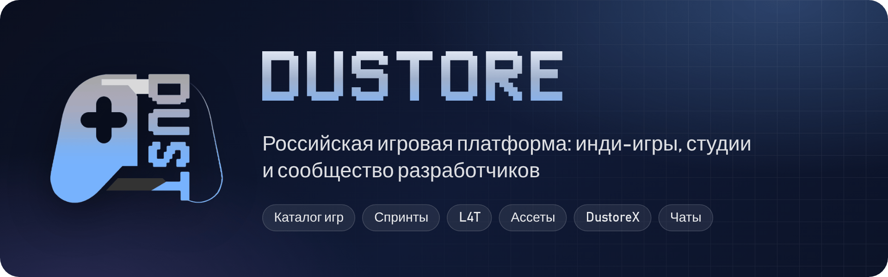

<picture>
  <source media="(prefers-color-scheme: dark)" srcset=".github/readme/banner-moonlight.png">
  <source media="(prefers-color-scheme: light)" srcset=".github/readme/banner-appolo.png">
  
</picture>

<p align="center">
  <a href="https://dustore.ru"><b>dustore.ru</b></a> ·
  <a href="https://dustore.ru/launcher">Скачать DustoreX</a> ·
  <a href="https://dustore.ru/whatsnew">Что нового</a> ·
  <a href="https://t.me/dustore_official">Telegram</a>
</p>

<p align="center">
  
  
  
  
  <a href="LICENSE"></a>
</p>

> [!NOTE]
> **В активной разработке — ищем контрибьюторов.**
> Желательно тех, кто скажет, что код говно, и покажет, как надо 🙂

**Dustore** — экосистема для инди-геймдева. Разработчик бесплатно публикует игру и не отдаёт платформе процент с продаж[^1]. Игроки находят проекты, которых нет на больших витринах. Команды собираются здесь же: на геймджемах, в поиске команды и в чатах студий.

> Давайте создадим магазин игр и приложений, которым будут пользоваться все!

---

## ✨ Что уже работает

### 🎮 Игрокам

| | |
|---|---|
| **[Каталог игр](https://dustore.ru/explore)** | Поиск, сортировка, фильтры по цене, превью при наведении |
| **Страница игры** | Скриншоты, отзывы, блок «Над игрой работали» |
| **[Коллекция](https://dustore.ru/library)** | Купленные и сохранённые игры, вишлист |
| **WebPlayer** | Веб-игры запускаются прямо в браузере |
| **[DustoreX](https://dustore.ru/launcher)** | Лаунчер для Windows и Android: магазин, загрузки, библиотека. **eXen** запускает совместимые Windows-игры на телефоне, **eXepad** превращает телефон в геймпад для ПК |
| **[Журнал RE:START](https://dustore.ru/magazine)** | Выпуски журнала об инди |
| **Оформление** | Темы Moonlight, PinkSparkle и хэллоуинская Madness. Силу 3D-эффектов кнопок и карточек можно настроить в профиле |

### 🛠 Разработчикам

| | |
|---|---|
| **[Консоль разработчика](https://dustore.ru/devs)** | Студия, публикация игр, монетизация |
| **[Экспертная оценка](https://dustore.ru/expert)** | Эксперты решают, какие игры попадают на Dustore |
| **[Спринты](https://dustore.ru/jams)** | Геймджемы с командами, загрузкой билдов и голосованием |
| **[L4T](https://dustore.ru/l4t)** | Поиск команды: профиль-резюме, биржа заявок, отклики, подборка «Для тебя» |
| **[Ассеты](https://dustore.ru/assetstore)** | База ассетов с покупкой через ЮKassa |
| **[GDDB](https://dustore.ru/gddb)** | Библиотека знаний по геймдеву |
| **[Лента разработчиков](https://dustore.ru/feed)** | Посты и анонсы студий |
| **[Подписки](https://dustore.ru/finv2)** и **[продвижение](https://dustore.ru/promo)** | Больше слотов под студии и проекты, API-доступ, расширенная статистика, продвижение игр |

### 💬 Сообщество

| | |
|---|---|
| **[Чаты](https://dustore.ru/chat)** | Личные и студийные беседы, файлы, ответы, пуш-уведомления |
| **Мобильная версия** | PWA `/m/`: ставится на экран «Домой», работает как приложение |
| **[Студии](https://dustore.ru/studios)** и **[участники](https://dustore.ru/users)** | Каталоги с профилями |
| **[Битый пиксель](https://dustore.ru/brokenpixel)** | Трекер багов |
| **Вход** | Через Telegram или по почте. Конфиденциальных данных платформа не требует: что рассказать о себе, решает пользователь |

---

## 🗺 Планы

<details open>
<summary><b>Игрокам</b></summary>

- [ ] **Подписки** — выгоднее покупать больше игр
- [ ] **Реферальная система** и прочие плюшки
- [ ] **Внутриигровые платежи** с очень низкой комиссией
- [ ] **Продвинутые отзывы** — в определённом формате. Это несложно, зато на платформе будет только качественный контент
- [ ] **Метка «AI-generated content»** — предупреждает об ИИ в игре
- [ ] **[Здесь мог бы быть ваш плюс]** — предложите его нам!

</details>

<details open>
<summary><b>Разработчикам</b></summary>

- [ ] **Стабилизация дохода** — благодаря подпискам игроков небольшой доход есть, даже если игру не скачивают
- [ ] **BugBounty** — за найденные уязвимости придумаем вознаграждение
- [ ] **Открытый рейтинг** — алгоритмы открыты для всех, и в ТОП может выйти каждый
- [ ] **«Пульс» проекта** — график активности разработки, как у репозитория на GitHub
- [ ] **Лента у каждой игры** — анонсы и новости прямо на странице проекта
- [x] **Виджет группы студии** — небольшая реклама на странице студии

</details>

<details open>
<summary><b>Платформе</b></summary>

- [ ] **Программа Предварительной Оценки** — решим проблему «холодного старта». Каждый сможет поучаствовать, акция ограничена во времени
- [ ] **Мероприятия (β)** — студии смогут проводить свои события, например выставки
- [ ] **Карта участника (β)** — сувенир, который можно подержать в руках. Что-то вроде «кнопки YouTube»
- [ ] **Доска «Спасибо»** — отзывы о платформе и донаты
- [ ] **Установка по кнопке** — купил игру с телефона, и она уже качается на компьютер[^3]
- [x] **0% комиссии для разработчиков**[^1] — а не 30%, как у Steam, Google Play и App Store[^2]
- [x] **Авторизация через Telegram**
- [x] **Лента разработчиков**
- [x] **Геймджемы** — это Спринты

</details>

---

## 🧱 Стек

| Слой | Технологии |
|---|---|
| Бэкенд | PHP 8.2+ без фреймворка, PDO |
| База данных | MariaDB / MySQL |
| Веб-сервер | Apache 2.4 + `mod_php`, маршруты в `.htaccess` (`mod_rewrite`) |
| Фронтенд | Vanilla JS и CSS без сборщика, PWA (Service Worker, Web Push) |
| Фоновые процессы | Node.js 18+: `pwa/push-worker.js` рассылает пуш-уведомления |
| Файлы | S3-совместимое хранилище (AWS SDK) |
| Платежи | ЮKassa, Robokassa |
| Почта | PHPMailer через SMTP |
| Клиенты | DustoreX для Windows и Android |

<details>
<summary><b>Структура репозитория</b></summary>

```text
.
├── index.php, explore.php, game.php …   страницы сайта (маршруты — в .htaccess)
├── swad/            ядро: config.php, controllers/, css/, js/, static/
├── devs/            консоль разработчика
├── chat/            мессенджер и web-push (push_doctor.php — диагностика пушей)
├── m/               мобильное PWA
├── jams/            Спринты (геймджемы)
├── l4t/             L4T — поиск команды
├── assetstore/      ассеты
├── expert/          экспертная оценка
├── gddb/            библиотека знаний (схема БД — в gddb/db/)
├── finv2/           подписки и услуги для разработчиков
├── whatsnew/        страница обновлений
├── pwa/             клиент и воркер web-push
├── api/             служебные API
└── sw.js            общий service worker сайта
```

</details>

---

## 🚀 Своя копия Dustore

> [!IMPORTANT]
> Дампа схемы основной базы в репозитории пока нет. Если разворачиваете копию, спросите структуру в [Issues](https://github.com/AlexanderLivanov/dustore/issues).

Инструкция для **Ubuntu 24.04**: в ней PHP 8.3 из коробки. Везде ниже меняйте `dustore.ru` на свой домен.

### 1. Пакеты

```bash
sudo apt update
sudo apt install -y apache2 libapache2-mod-php mariadb-server composer \
    php php-mysql php-curl php-mbstring php-xml php-zip
sudo mysql_secure_installation
sudo a2enmod rewrite
```

### 2. Код и зависимости

```bash
sudo git clone https://github.com/AlexanderLivanov/dustore.git /var/www/html/dustore.ru
cd /var/www/html/dustore.ru
sudo composer install --no-dev          # vendor/ не хранится в репозитории
sudo chown -R www-data:www-data /var/www/html/dustore.ru
```

### 3. Виртуальный хост

```bash
sudo nano /etc/apache2/sites-available/dustore.ru.conf
```

```apacheconf
<VirtualHost *:80>
    ServerName dustore.ru
    DocumentRoot /var/www/html/dustore.ru

    # Без этого не заработают .htaccess: пропадут красивые адреса вроде /g/123
    <Directory /var/www/html/dustore.ru>
        AllowOverride All
        Require all granted
    </Directory>

    ErrorLog ${APACHE_LOG_DIR}/dustore-error.log
    CustomLog ${APACHE_LOG_DIR}/dustore-access.log combined
</VirtualHost>
```

> [!WARNING]
> В корневом `.htaccess` лимиты загрузки заданы через `php_value`, а это работает только с `mod_php`. На PHP-FPM сайт ответит 500. Тогда перенесите эти строки в настройки пула.

### 4. Секреты: `swad/pass.php`

Файл в `.gitignore`, создайте его сами:

```php
<?php
// База данных: [хост, имя БД, пользователь, пароль]
function use_pack($server_type)
{
    if ($server_type == "PRODUCTION") {
        return ['localhost', 'dustore', 'DB_USER', 'DB_PASSWORD'];
    } else if ($server_type == "LOCAL") {   // localhost и частные IP
        return ['localhost', 'dustore', 'root', ''];
    }
}

// S3-совместимое хранилище
define('AWS_S3_KEY', '');
define('AWS_S3_SECRET', '');
define('AWS_S3_REGION', '');
define('AWS_S3_ENDPOINT', '');
define('AWS_S3_BUCKET_USERCONTENT', '');
define('AWS_S3_BUCKET_JAMS', '');       // билды Спринтов

// Telegram-бот для входа
define('BOT_TOKEN', '');
define('LOCAL_BOT_TOKEN', '');          // необязательно: бот для локальной копии

// Почта (SMTP-сервер и логин — в swad/controllers/send_email.php)
define('EMAIL_PASSWD', '');

// ЮKassa
define('YOOKASSA_SHOP_ID', '');
define('YOOKASSA_SHOP_KEY', '');
define('YOOKASSA_SECRET_KEY', '');
```

### 5. Запуск

```bash
sudo a2ensite dustore.ru.conf
sudo systemctl reload apache2
```

<details>
<summary><b>6. Пуш-уведомления (необязательно)</b></summary>

Цепочка: браузер → `chat/push_subscribe.php` → очередь `push_outbox` → воркер на Node → push-сервис браузера → `sw.js`.

**Ключи.** Сайт и воркер ищут их в одних и тех же местах, по порядку: env, `PUSH_ENV_FILE`, `../dustore-push.env` над папкой сайта, `api/push/.env`, `/etc/dustore/push.env`. Секрет моста можно не заводить: без него обе стороны выводят его из приватного ключа.

```bash
npx web-push generate-vapid-keys        # обе строки — из одного вывода!
sudo mkdir -p /etc/dustore
sudo tee /etc/dustore/push.env > /dev/null <<'EOF'
VAPID_PUBLIC=...
VAPID_PRIVATE=...
VAPID_SUBJECT=mailto:admin@dustore.ru
EOF
openssl rand -hex 32 | sudo tee /etc/dustore/bridge.secret > /dev/null
sudo chgrp www-data /etc/dustore/push.env /etc/dustore/bridge.secret
sudo chmod 640 /etc/dustore/push.env /etc/dustore/bridge.secret
```

Фоновые скрипты сайт вызывает у самого себя так же, по имени через петлю. На своём домене задайте Apache `SetEnv LOOPBACK_URL https://ваш-домен`.

**Таблицы:**

```sql
CREATE TABLE push_subscriptions (
  id INT AUTO_INCREMENT PRIMARY KEY,
  user_id INT NOT NULL,
  endpoint VARCHAR(1024) NOT NULL,
  p256dh VARCHAR(255) NOT NULL,
  auth VARCHAR(255) NOT NULL,
  user_agent VARCHAR(255) NULL,
  created_at TIMESTAMP DEFAULT CURRENT_TIMESTAMP,
  UNIQUE KEY uq_endpoint (endpoint(512)),
  KEY idx_user (user_id)
);

CREATE TABLE push_outbox (
  id INT AUTO_INCREMENT PRIMARY KEY,
  user_id INT NOT NULL,
  title VARCHAR(255),
  body TEXT,
  url VARCHAR(512),
  status ENUM('pending','sent','failed') DEFAULT 'pending',
  attempts INT DEFAULT 0,
  created_at DATETIME,
  KEY idx_status (status, id)
);
```

**Воркер как служба.** Сначала `npm install --omit=dev` в корне сайта, затем `/etc/systemd/system/dustore-push.service`:

```ini
[Unit]
Description=Dustore web-push worker
After=network.target apache2.service

[Service]
User=www-data
WorkingDirectory=/var/www/html/dustore.ru
# Ключи воркер читает сам — из тех же файлов и в том же порядке, что сайт
# (chat/_push_config.php). EnvironmentFile не нужен: env у воркера главнее
# файлов, и ключи могли бы разъехаться с сайтом.
# В outbox воркер ходит по имени сайта, но через 127.0.0.1: на голом
# http://127.0.0.1 может ответить другой сайт сервера. Свой домен — так:
# Environment=OUTBOX_URL=https://ваш-домен/chat/push_outbox.php
ExecStart=/usr/bin/node pwa/push-worker.js
Restart=always

[Install]
WantedBy=multi-user.target
```

```bash
sudo systemctl enable --now dustore-push
```

**Почтовые рассылки** из `/devs/notifications` с дневным лимитом продолжаются на следующий день сами — их подхватывает тот же воркер пушей. Если воркера нет, нужен cron:

```bash
echo '*/10 * * * * www-data php /var/www/html/dustore.ru/devs/broadcast_mail.php' | sudo tee /etc/cron.d/dustore-mail
```

**Проверка всей цепочки.** Скрипт находит сломанное звено и отправляет тестовый пуш:

```bash
sudo -u www-data php chat/push_doctor.php --send=<ваш user_id>
```

</details>

### Траблшутинг

Вопросы и проблемы — в [Issues](https://github.com/AlexanderLivanov/dustore/issues). Любые комментарии и поправки (особенно негативные) приветствуются.

---

## 🤝 Как помочь

- **Нашли баг** — заведите [Issue](https://github.com/AlexanderLivanov/dustore/issues).
- **Нашли уязвимость** — не публикуйте её, а напишите по контактам из [SECURITY.md](SECURITY.md).
- **Хотите в команду** — ищем PHP- и JS-разработчиков, дизайнеров и тестировщиков. Пишите в [Telegram](https://t.me/dustore_official).
- **Pull request'ы** — всегда рады. Небольшие и с понятным описанием вливаются быстрее.

## 📄 Лицензия

[Apache License 2.0](LICENSE)

[^1]: Для участников Программы Предварительной Оценки (ППО) регистрация игр будет бесплатной, а комиссия за продажи составит всего 1%.

[^2]: App Store тоже снижает комиссию разработчикам с доходом до 1 млн $, но требует ежегодный взнос 99 $.

[^3]: При условии, что компьютер включён.
